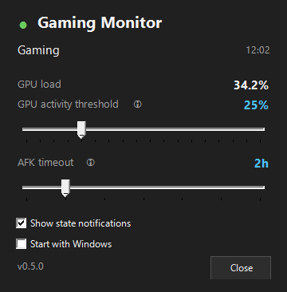

# GamingMonitor

> [!WARNING]
> This project was vibe-coded from start to finish. It works on the author's
> machine, but expect quirks and minimal error handling.
> Review the code before trusting it with your power settings.

A lightweight Windows system-tray utility that keeps your PC awake while you are
gaming, rendering, or downloading games — and lets it sleep otherwise.

**What it does:**
- 🎮 Notices gamepad activity (DualSense, XInput, and other HID pads) and GPU load, blocks display sleep and system sleep while you play
- 📥 Notices Steam/Xbox downloads, blocks system sleep (but lets the display turn off) until they finish
- 🔄 Updates itself from GitHub Releases in one click, preserving your settings

| State | Trigger | Display | System sleep |
|---|---|---|---|
| `Gaming` | Gamepad input or GPU load above threshold | stays on | blocked |
| `Downloading` | Active game download | may turn off | blocked |
| `Idle` | None of the above | may turn off | allowed |

## Installation

1. Download `GamingMonitor-vX.Y.Z-win-x64.zip` from
   [Releases](https://github.com/dms137/gamingMonitor/releases).
2. Extract the archive preserving the folder structure
   (for example into `C:\Tools\GamingMonitor\`), so `assets\GM.ico`
   stays next to `GamingMonitor.exe`.
3. Run `GamingMonitor.exe`. Tick `Start with Windows` in the settings
   flyout (left-click the tray icon) for autostart.

No .NET runtime needed — release builds are self-contained single-file.
Requires Windows 10 version 1709+ / Windows 11.

## Settings flyout

Left-click the tray icon (or click any state toast) to open it:
live GPU load, current state with trigger reason and duration,
GPU threshold slider (5–90%), AFK timeout slider (1–6h + Never),
`Show state notifications` and `Start with Windows` toggles,
running version.

No keyboard, mouse or gamepad input for the AFK timeout (default 2h)
force-releases `Gaming` back to `Idle`, even if the GPU is still busy.
Downloads stay exempt.

Fine-tuning lives in `assets\settings.json` — see
[Configuration](docs/configuration.md).

## Updates

The app checks GitHub Releases on startup (`Check for updates` in the
tray menu does it on demand). A toast with a **Download and install**
button downloads the release zip, swaps the files, and restarts —
your `settings.json` survives.

## If Windows blocks the app

- **SmartScreen** (“Windows protected your PC”): `More info` → `Run anyway`.
- **Smart App Control** (silent block): no per-app bypass exists; turning it
  off is a one-way door (no re-enable without reinstalling Windows).
- Details: [Troubleshooting](docs/troubleshooting.md).

## Docs

- [Architecture](docs/architecture.md) — engine, monitors, power control
- [Configuration](docs/configuration.md) — `settings.json` reference
- [Development](docs/development.md) — build, publish, release process
- [Troubleshooting](docs/troubleshooting.md) — SmartScreen/SAC, logs
